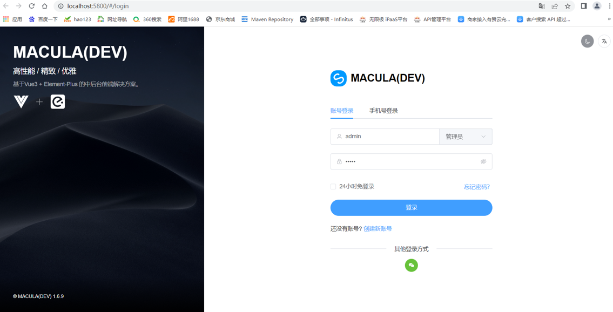
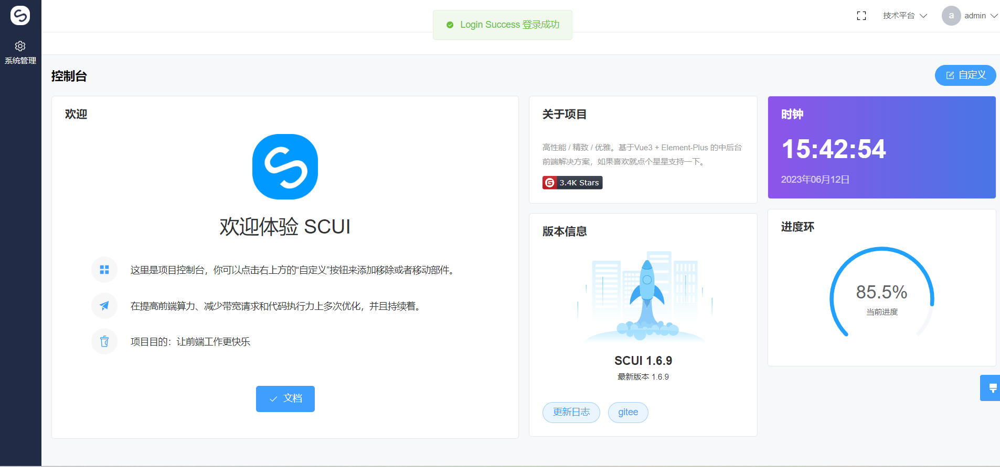
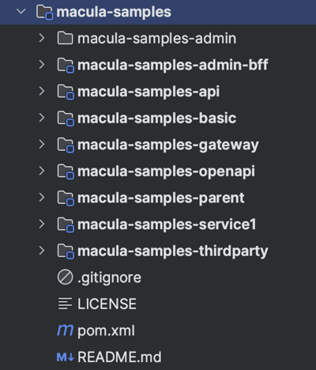

## 概述

Macula快速开始内容主要包括两部分：一是Macula Cloud平台搭建，二是Macula Cloud平台接入。

## Macula Cloud平台搭建

### 环境准备

需要准备好JDK、Maven、Node.js、MySQL、Redis、Nacos，IDE建议使用idea，相关版本信息如下：

|  软件   | 版本  | 说明  |
|  ----  | ----  | ----  |
|  JDK   | 1.8以上  |   |
|  Maven   | 3.8.1以上  |   |
|  Node.js   | 14.18.3以上  |   |
|  MySQL   | 5.7.0以上  |   |
|  Redis   | 3.0.0以上  |   |
|  Nacos   | 2.0.0以上  |   |

### 项目搭建

##### JDK安装

请根据操作系统和CPU型号选择合适的JDK安装，需要JDK8

##### NodeJS安装

打开Node.js的官方网站（https://nodejs.org/zh-cn/）并下载适用于你操作系统的安装包。

##### Redis安装

可以参考[官网](https://redis.io/docs/getting-started/)的安装文档选择对应的版本和操作系统安装redis。安装完成后运行redis-server启动。

##### Nacos安装

可以参考[Nacos官网](https://nacos.io/zh-cn/docs/v2/quickstart/quick-start.html)安装Nacos。

##### MySQL准备

MySQL准备好后，需要执行macula-cloud-system中的DDL建表语句，完成system系统管理的数据库表初始化。

##### 克隆项目源码

```shell
git clone https://github.com/macula-projects/macula-cloud.git							# 后端代码
git clone https://github.com/macula-projects/macula-cloud-admin.git				# 前端代码
```

将上述项目导入IDEA和Visual Code。

### 项目运行

##### 打开Visual Code，导入macula-cloud-admin

```shell
npm install				# 安装npm依赖包
npm run dev				# 本地运行前端应用
```

打开浏览器，访问前端配置的网址，如http://localhost:5800/

成功进入登录页面，即前端启动成功。

  

##### 打开IDEA或者Eclipse导入macula-cloud代码

- 启动macula-cloud-iam
- 启动macula-cloud-gateway
- 启动macula-cloud-system

其它模块按照需要启动使用

使用默认密码admin/admin登录系统，进入系统控制台，运行成功。

   

## 使用脚手架创建自己的平台

```sh
mvn archetype:generate \
    -DgroupId=dev.macula.samples	\										# 你的应用的GroupID
    -DartifactId=macula-samples	\											# 你的应用的ArtifactId
    -Dversion=1.0.0-SNAPSHOT \												# 你的应用的版本号
    -DarchetypeArtifactId=macula-boot-archetype \ 
    -DarchetypeGroupId=dev.macula.boot \
    -DarchetypeVersion=5.0.0 \
    -Dgitignore=.gitignore -DinteractiveMode=false
```

运行完成后将生成如下工程：



### Macula平台管理员创建用户、租户

各应用平台（租户）想接入Macula平台，首先要联系Macula平台的管理员，在MaculaCloudAdmin后台为各应用平台创建对应的租户以及管理账号。

### Macula平台租户管理员创建应用

各应用平台获得Macula平台的管理账号后，即可登录MaculaCloudAdmin后台，进行应用创建、菜单创建等操作。

### macula-samples运行步骤

- 找到macula-samples-service1/docs/macula-samples-service1.sql，创建数据库，导入SQL创建示例表
- 向Macula Cloud申请应用接入，应用名称是macula-samples-admin-bff，修改上述应用的配置
    ```yaml
    macula:
      cloud:
        endpoint: http://127.0.0.1:9000                   # macula cloud网关地址
        app-key: ${spring.application.name}
        secret-key: 待修改
  ```
- 向Macula平台（统一认证IAM服务）申请oauth2的client

  修改macula-samples-admin/src/views/common/login/components/passwordForm.vue，修改client_id和client_secret
  
    ```html
        var data = {
          username: this.form.user,
          password: this.form.password,
          grant_type: 'password',
          client_id: '待修改',
          client_secret: '待修改',
          scope: 'message.read message.write userinfo'
        }
    ```
