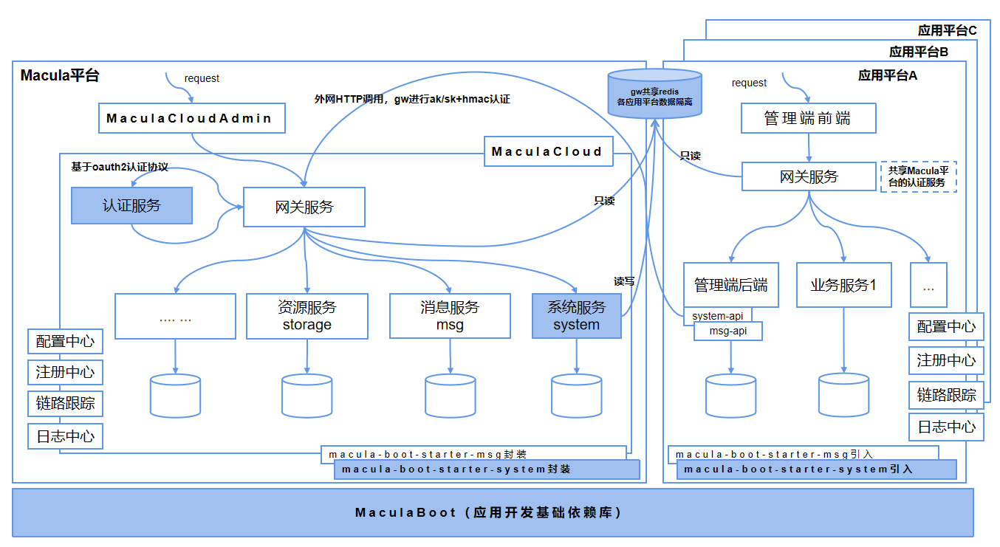

## 平台简介
Macula是一个微服务应用开发平台，主要包括两大模块：MaculaBoot和MaculaCloud（包括统一管理端MaculaCloudAdmin）。MaculaBoot是微服务应用开发所需的SDK（如SpringCloudAlibaba、SpringCloudTecent等），基于众多开源产品进行甄选后轻度封装而成。MaculaCloud是一个微服务架构的通用技术服务体系，提供了大量通用的PaaS能力（如统一网关、统一认证、系统管理、消息推送、资源存储、ID生成、任务调度等）。MaculaCloudAdmin是基于VUE的前端项目，与MaculaCloud配套，提供统一管理端功能。使用Macula进行微服务架构的应用平台开发，一方面可以统一技术栈，降低管理与维护成本；另一方面可以避免重复造轮子，提升开发效率。

## 整体架构
Macula的整体功能架构如下图所示：

## 主要功能
### MaculaCloud
+ 统一网关：所有请求的入口，负责统一的认证、鉴权、路由、限流、降级
+ 统一认证：即IAM服务，提供多种认证协议（Oauth2、OIDC、SAML2、CAS等），集成多种身份源（企微、钉钉等）
+ 系统服务：包括菜单管理、角色管理、用户管理、租户管理、应用管理、客户端管理、字典管理与审计日志等通用系统功能
+ 消息推送：集成个微消息、企微消息、腾讯推送等消息渠道
+ 资源存储：集成七牛云存储、阿里云存储与腾讯云存储
+ ID生成：集成滴滴开源的TinyID服务
+ 任务调度：集成powerjob服务
+ 其他（如审批流、短链、数据源版本管理）
### MaculaBoot
+ Feign：统一使用Feign进行HTTP远程调用
+ Lock4j：统一使用Lock4j进行分布式锁控制
+ Idempotent：统一使用Idempotent进行幂等控制
+ Seata：统一使用Seata进行分布式事务控制
+ SpringCloudGateway：统一使用SCG作为应用网关
+ SpringCloudAlibaba:阿里开源的SpringCloud版本（按需选择）
+ SpringCloudTecent：腾讯开源的SpringCloud版本（按需选择）
+ SpringCloudTsf：腾讯TSF需要依赖的包（按需选择）
+ 其他（Election、Statemachine、retry、mapstruct、mybatis、redis、web等）
## 技术原理
基于Macula平台，搭建各应用平台（如应用平台A/B/C，各应用平台拥有自己的微服务上下文），共享Macula平台的认证服务，依赖Macula平台的通用PaaS能力（系统服务、消息服务、资源服务等）。如下图所示：

> 说明：Macula特别适用于多产品线（一个产品线对应一个应用平台）的研发团队

+ 系统服务：主要提供“获取个人信息”和“获取菜单列表”两个核心接口。核心功能实现了通过个人信息的角色实现对菜单列表的权限过滤。这两个接口Macula平台侧是不做缓存的，由各应用平台侧自己按需实现缓存机制

+ gw共享Redis：缓存的是菜单对应的api权限信息，在MaculaCloudAdmin配置各应用平台菜单对应的api权限时，由系统服务写入共享Redis，各应用平台的网关配置使用共享的Redis即可。这里要注意该共享的Redis只作api权限缓存，各应用平台应有另外单独的缓存业务数据的Redis。这里搞个各应用平台网关共享的Redis，是为了提高并发量，避免各应用平台都要通过api调用Macula平台的网关获取api权限信息。

+ 认证流程：用户先在认证服务完成认证并获取oauth2的token，再携带token访问网关具体API，网关服务调用认证服务验证token的有效性，验证通过后会把token转换成jwt，随后通过请求头把jwt传递到下游的微服务，下游的微服务会通过共享的工具包获取并本地验证jwt的合法性。这样处理的原因是为了提高并发量，避免下游微服务还要远程调用认证服务验证token的有效性。

## License

Macula Boot and Macula Cloud is Open Source software released under the [Apache 2.0 license](https://www.apache.org/licenses/LICENSE-2.0.html).

