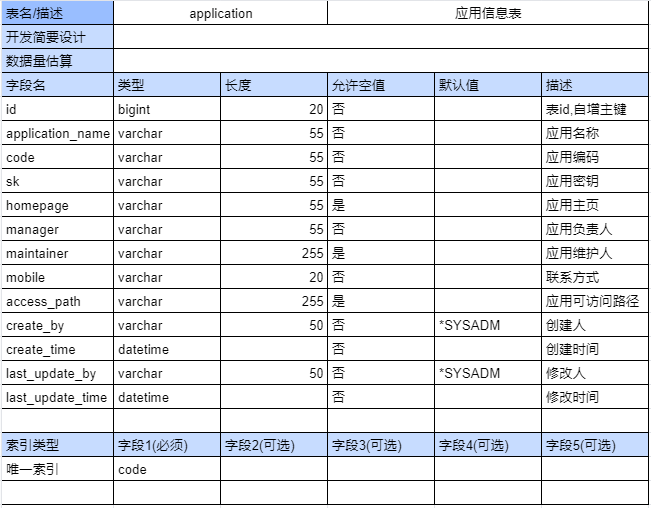
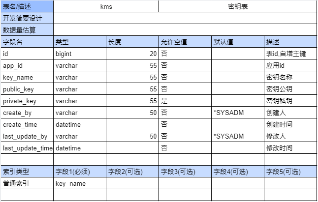
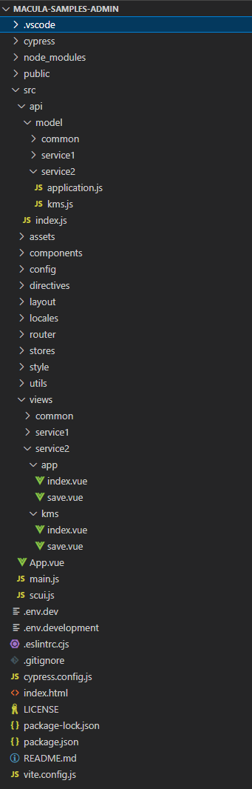

## 概述

针对在macula-samples平台中创建业务微服务macula-samples-service1案例的开发过程进行说明。

## （1）业务需求说明

实现一个简单的应用与秘钥的管理功能。

## （2）后端开发流程

* 创建macula-samples-service1

*（pom文件引入需要的starter依赖、修改macula-samples平台上下文的PaaS组件配置）*

```xml
<!-- web应用基础依赖包， 统一处理返回对象及异常等 -->
<dependency>
    <groupId>dev.macula.boot</groupId>
    <artifactId>macula-boot-starter-web</artifactId>
</dependency>
<!-- 应用安全基础依赖包， 主要获取用户上下文及接口安全拦截等 -->
<dependency>
    <groupId>dev.macula.boot</groupId>
    <artifactId>macula-boot-starter-security</artifactId>
</dependency>
<!-- 基于swgger的doc 基础依赖包 -->
<dependency>
    <groupId>dev.macula.boot</groupId>
    <artifactId>macula-boot-starter-springdoc</artifactId>
</dependency>
<!-- mysql,druid,mybatis-plus 组成的基础依赖包 -->
<dependency>
    <groupId>dev.macula.boot</groupId>
    <artifactId>macula-boot-starter-mybatis-plus</artifactId>
</dependency>
<!-- 基于mapstruct 基础依赖包 -->
<dependency>
    <groupId>dev.macula.boot</groupId>
    <artifactId>macula-boot-starter-mapstruct</artifactId>
</dependency>
<!-- 基于redission组成的基础依赖包 -->
<dependency>
    <groupId>dev.macula.boot</groupId>
    <artifactId>macula-boot-starter-redis</artifactId>
</dependency>
<!-- alibaba 微服务治理体系组成的基础依赖包 -->
<dependency>
    <groupId>dev.macula.boot</groupId>
    <artifactId>macula-boot-starter-cloud-alibaba</artifactId>
</dependency>
<!-- Macula V5 获取应用菜单及登录用户相关信息必须依赖 -->
<dependency>
    <groupId>dev.macula.boot</groupId>
    <artifactId>macula-boot-starter-system</artifactId>
</dependency>
<!-- Macula V5 规范的应用分层实践依赖 -->
<dependency>
    <groupId>dev.macula.samples</groupId>
    <artifactId>macula-samples-service1-api</artifactId>
    <version>${project.version}</version>
</dependency>
```
* 数据库表设计

应用实体表：



```sql
CREATE TABLE `application`
(
    `id` bigint NOT NULL AUTO_INCREMENT,
    `application_name` varchar(55) NOT NULL,
    `code`             varchar(55) NOT NULL COMMENT '应用编码',
    `sk`               varchar(55) NOT NULL COMMENT '应用密钥',
    `homepage`         varchar(55)          DEFAULT NULL,
    `manager`          varchar(55) NOT NULL COMMENT '负责人',
    `maintainer`       varchar(255)         DEFAULT NULL COMMENT '维护人',
    `mobile`           varchar(20) NOT NULL COMMENT '联系方式',
    `access_path`      varchar(255)         DEFAULT NULL COMMENT '可访问路径',
    `create_by`        varchar(50) NOT NULL DEFAULT '*SYSADM' COMMENT '创建人',
    `create_time`      datetime    NOT NULL COMMENT '创建时间',
    `last_update_by`   varchar(50) NOT NULL DEFAULT '*SYSADM' COMMENT '更新人',
    `last_update_time` datetime    NOT NULL COMMENT '更新时间',    
    PRIMARY KEY (`id`),
    UNIQUE KEY `sys_application_tenant_code_IDX` (`code`) USING BTREE
) ENGINE=InnoDB AUTO_INCREMENT=1 DEFAULT CHARSET=utf8 COMMENT='应用信息表';
```

秘钥实体表：



```sql
 CREATE TABLE `kms` (
  `id` bigint(20) NOT NULL AUTO_INCREMENT COMMENT '表id,自增主键',
  `app_id` varchar(100) NOT NULL COMMENT '应用id，密钥所属应用',
  `key_name` varchar(30) NOT NULL COMMENT '密钥名称',
  `public_key` longtext NOT NULL COMMENT '密钥公钥',
  `private_key` longtext COMMENT '密钥私钥',
  `create_by` varchar(50) NOT NULL COMMENT '创建人， 自动填充字段',
  `create_time` datetime NOT NULL COMMENT '创建时间， 自动填充字段',
  `last_update_by` varchar(50) NOT NULL COMMENT '最后修改人， 自动填充字段',
  `last_update_time` datetime NOT NULL COMMENT '最后修改时间， 自动填充字段',
  PRIMARY KEY (`id`),
  KEY `key_name` (`key_name`) USING BTREE
    ) ENGINE=InnoDB AUTO_INCREMENT=1 DEFAULT CHARSET=utf8 COMMENT='密钥表';
```

* 数据存取层开发

*（query、form、entity和bo对象的定义，mapper的method定义及实现）*

entity常用注解说明：

```java
@TableName("kms") // 类注解、标识该entity对应的数据库表为kms
@TableLogic(value = "0", delval = "1") //字段注解、标识作为逻辑删除字段，当使用框架Dao方法查询时默认过滤该字段为1的数据
@TableField(exist = false) //字段注解、标识字段对应的字段名、填充支持及不检查字段存在等等
@TableId( value = "id", type = IdType.AUTO ) // 字段注解、标识字段作为实体主键
```

entity编码：

```java
// 实体类基类
@Getter
@Setter
public class BaseEntity implements Serializable { 
    private static final long serialVersionUID = 1L;
    
    @JsonSerialize(using = ToStringSerializer.class)
    @Schema(description = "主键id")
    @TableId(value = "id", type = IdType.AUTO)
    private Long id;

    @Schema(description = "创建人")
    @TableField(fill = FieldFill.INSERT)
    private String createBy;

    @Schema(description = "更新人")
    @TableField(fill = FieldFill.INSERT)
    private LocalDateTime createTime;

    @Schema(description = "创建时间")
    @TableField(fill = FieldFill.INSERT_UPDATE)
    private String lastUpdateBy;

    @Schema(description = "更新时间")
    @TableField(fill = FieldFill.INSERT_UPDATE)
    private LocalDateTime lastUpdateTime;

}
//应用实体类
@Data
@EqualsAndHashCode(callSuper = true)
@TableName("application")
public class Application extends BaseEntity {

    /**
     * 应用名称
     */
    private String applicationName;

    /**
     * 应用主页URL
     */
    private String homepage;

    /**
     * 应用SecretKey
     */
    private String sk;

    /**
     * 负责人
     */
    private String manager;

    /**
     * 维护人
     */
    private String maintainer;

    /**
     * 移动电话
     */
    private String mobile;

    /**
     * 应用编码
     */
    private String code;

    /**
     * 可访问路径正则
     */
    private String accessPath;
    
    /**
     * 是否允许回传属性
     */
    private boolean useAttrs;

    /**
     * 允许回传的属性
     */
    private String allowedAttrs;
}
//秘钥实体类
@Data
@EqualsAndHashCode(callSuper = true)
@TableName("kms")
public class Kms  extends BaseEntity {
    /**
     * 应用id，密钥所属应用
     */
    private Long appId;

    @Schema(
            description = "密钥名称"
    )
    /**
     * 密钥名称
     */
    private String keyName;

    @Schema(
            description = "密钥公钥"
    )
    @TableField(fill = FieldFill.INSERT, updateStrategy = FieldStrategy.NEVER)
    private String publicKey;

    @Schema(
            description = "密钥私钥"
    )
    @TableField(fill = FieldFill.INSERT, updateStrategy = FieldStrategy.NEVER)
    private String privateKey;
}
```

bo编码：

```java
// ApplicationBo
@Data
public class ApplicationBO {

    private Long id;

    /**
     * 应用名
     */
    private String applicationName;

    private String sk;

    /**
     * 主页
     */
    private String homepage;

    /**
     * 负责人
     */
    private String manager;

    /**
     * 维护人
     */
    private String maintainer;

    /**
     * 手机号
     */
    private String mobile;

    /**
     * 应用编码
     */
    private String code;

    /**
     * 可访问url
     */
    private String accessPath;

    /**
     * 创建时间
     */
    @JsonFormat(pattern = "yyyy-MM-dd")
    private Date createTime;

    /**
     * 是否回传属性
     */
    private boolean useAttrs;

    /**
     * 回传属性列表
     */
    private String allowedAttrs;
}

// KmsBo 
@Schema(description = "密钥应用多表查询对象")
@Data
public class KmsBo implements Serializable {

    @Schema(description = "ID")
    private Long id;

    @Schema(description = "应用对应ID")
    private Long appId;

    @Schema(description = "应用编码")
    private String appCode;

    @Schema(description = "应用铝盘")
    private String appName;

    @Schema(description = "密钥名称")
    private String keyName;
}
```

Mapper编码：

```java
// ApplicationMapper
@Mapper
public interface ApplicationMapper extends BaseMapper<Application> {
    Page<ApplicationBO> listApplicationPages(IPage<Application> page, ApplicationPageQuery queryParams);
}

// KmsMapper
@Mapper
public interface KmsMapper extends BaseMapper<Kms> {
    Page<KmsBo> listKmsPages(IPage<KmsBo> page, KmsPageQuery queryParams);
}
```

自定义sql编写：

在resources下创建文件mapper/KmsMapper.xml，编写内容：

```xml
<?xml version="1.0" encoding="UTF-8"?>
<!DOCTYPE mapper
        PUBLIC "-//mybatis.org//DTD Mapper 3.0//EN"
        "http://mybatis.org/dtd/mybatis-3-mapper.dtd">
<mapper namespace="dev.macula.samples.service2.mapper.KmsMapper">

    <select id="listKmsPages" resultType="dev.macula.samples.service2.pojo.bo.KmsBo">
        SELECT
        skt.id as id,
        sat.id as app_id,
        code as app_code,
        sat.application_name as app_name,
        key_name
        FROM
        kms skt
        LEFT JOIN
        application sat
        ON skt.app_id = sat.id
        <where>
            <if test='queryParams.keywords !=null  and queryParams.keywords.trim() neq ""'>
                AND (skt.key_name like concat('%',#{queryParams.keywords},'%')) OR
                (sat.code like concat('%',#{queryParams.keywords},'%'))
            </if>
        </where>
    </select>
</mapper>
```

在resources下创建文件mapper/ApplicationMapper.xml，编写内容：

```xml
<?xml version="1.0" encoding="UTF-8"?>
<!DOCTYPE mapper
        PUBLIC "-//mybatis.org//DTD Mapper 3.0//EN"
        "http://mybatis.org/dtd/mybatis-3-mapper.dtd">
<mapper namespace="dev.macula.samples.service2.mapper.ApplicationMapper">

    <select id="listApplicationPages" resultType="dev.macula.samples.service2.pojo.bo.ApplicationBO">
        SELECT
        id,
        application_name,
        sk,
        homepage,
        code,
        access_path,
        manager,
        maintainer,
        mobile,
        create_time,
        use_attrs,
        allowed_attrs
        FROM
        application
        <where>
            <if test='queryParams.keywords !=null  and queryParams.keywords.trim() neq ""'>
                AND (application_name like concat('%',#{queryParams.keywords},'%')) OR
                (code like concat('%',#{queryParams.keywords},'%'))
            </if>
        </where>
    </select>
</mapper>
```

* 业务逻辑层开发

*（query、form、vo对象定义，service的method定义及实现）*

service接口编码：

```java
// Application
/**
 * 应用业务接口
 */
public interface ApplicationService extends IService<Application> {

    /**
     * 应用分页列表
     *
     * @return 应用列表
     */
    Page<ApplicationVO> listApplicationPages(ApplicationPageQuery queryParams);

    /**
     * 新增应用
     *
     * @param appForm 应用表单对象
     * @return 是否成功, boolean
     */
    boolean saveApplication(ApplicationForm appForm);

    /**
     * 修改应用
     *
     * @param appId   应用ID
     * @param appForm 应用表单对象
     * @return 是否成功，boolean
     */
    boolean updateApplication(Long appId, ApplicationForm appForm);

    /**
     * 删除应用
     *
     * @param idsStr 应用ID，多个以英文逗号(,)分割
     * @return 是否成功，boolean
     */
    boolean deleteApplications(String idsStr);

    /**
     * 管理维护人
     *
     * @param appId
     * @param appForm
     * @return 是否成功，boolean
     */
    boolean addMaintainer(Long appId, ApplicationForm appForm);
}

// KmsService
 /**
 * 密钥业务接口
 */
public interface KmsService extends IService<Kms> {
    /**
     * 密钥分页列表
     *
     * @return 密钥列表
     */
    Page<KmsVo> listKmss(KmsPageQuery queryParams);

    /**
     * 新增密钥
     *
     * @param kmsForm 密钥表单对象
     * @return 是否成功, boolean
     */
    boolean saveKms(KmsForm kmsForm);

    /**
     * 修改密钥
     *
     * @param kmsId   密钥ID
     * @param kmsForm 密钥表单对象
     * @return 是否成功，boolean
     */
    boolean updateKms(Long kmsId, KmsForm kmsForm);

    /**
     * 删除密钥
     *
     * @param idsStr 密钥ID，多个以英文逗号(,)分割
     * @return 是否成功，boolean
     */
    boolean deleteKmss(String idsStr);

    /**
     * 应用id中是否存在绑定kms密钥
     * @param idsStr 应用ID，多个以英文逗号(,)分割
     * @return
     */
    boolean existsApp(String idsStr);
}
```

serviceImpl接口实现编码：

```java
// ApplicationServcieImpl
@Service
@RequiredArgsConstructor
public class ApplicationServiceImpl extends ServiceImpl<ApplicationMapper, Application> implements ApplicationService {

    private final ApplicationConverter applicationConverter;
    private final KmsService kmsService;
    @Override
    public Page<ApplicationVO> listApplicationPages(ApplicationPageQuery queryParams) {
        Page<Application> page = new Page<>(queryParams.getPageNum(), queryParams.getPageSize());
        Page<ApplicationBO> bo = this.baseMapper.listApplicationPages(page, queryParams);;
        return applicationConverter.bo2Vo(bo);
    }

    @Override
    @Transactional
    public boolean saveApplication(ApplicationForm appForm) {
        Application application = applicationConverter.form2Entity(appForm);
        return this.save(application);
    }

    @Override
    @Transactional
    public boolean updateApplication(Long appId, ApplicationForm appForm) {
        Application application = applicationConverter.form2Entity(appForm);
        application.setId(appId);
        return this.updateById(application);
    }

    @Override
    @Transactional
    public boolean deleteApplications(String idsStr) {
        Assert.isTrue(StrUtil.isNotBlank(idsStr), "删除的应用数据为空");
        Assert.isFalse(kmsService.existsApp(idsStr), "应用数据被绑定删除失败");
        // 逻辑删除
        List<Long> ids = Arrays.stream(idsStr.split(",")).map(Long::parseLong).collect(Collectors.toList());
        return this.removeByIds(ids);
    }

    @Override
    @Transactional
    public boolean addMaintainer(Long appId, ApplicationForm appForm) {
        Application application = this.getById(appId);
        application.setMaintainer(appForm.getMaintainer());
        return this.updateById(application);
    }
}

// KmsServiceImpl
@Service
@RequiredArgsConstructor
public class KmsServiceImpl extends ServiceImpl<KmsMapper, Kms> implements KmsService {

    private final KmsConverter kmsConverter;

    @Override
    public Page<KmsVo> listKmss(KmsPageQuery queryParams) {
        Page<KmsBo> page = new Page(queryParams.getPageNum(), queryParams.getPageSize());
        Page<KmsBo> bo = this.baseMapper.listKmsPages(page, queryParams);
        return kmsConverter.bo2Vo(bo);
    }

    @Override
    @Transactional
    public boolean saveKms(KmsForm kmsForm) {
        Kms kms = kmsConverter.form2Entity(kmsForm);
        Map<String, String> keyPair = RSAUtil.getKeyPair();
        Assert.notEmpty(keyPair, "生成RSA密钥对失败！");
        kms.setPublicKey(keyPair.get("publicKey"));
        kms.setPrivateKey(keyPair.get("privateKey"));
        return this.save(kms);
    }

    @Override
    @Transactional
    public boolean updateKms(Long kmsId, KmsForm kmsForm) {
        Kms kms = kmsConverter.form2Entity(kmsForm);
        kms.setId(kmsId);
        return this.updateById(kms);
    }

    @Override
    @Transactional
    public boolean deleteKmss(String idsStr) {
        Assert.isTrue(StrUtil.isNotBlank(idsStr), "删除的密钥数据为空");
        // 逻辑删除
        List<Long> ids = Arrays.stream(idsStr.split(",")).map(Long::parseLong).collect(Collectors.toList());
        return this.removeByIds(ids);
    }

    @Override
    public boolean existsApp(String idsStr) {
        List<Long> ids = Arrays.stream(idsStr.split(",")).map(Long::parseLong).collect(Collectors.toList());
        return exists(new LambdaQueryWrapper<Kms>().in(Kms::getAppId, ids));
    }
}
```

* 展示层开发

*（query、form、vo对象定义，controller的method定义及实现）*

将传递进来的数据进行持久化以及将处理好的数据显示回去。传递进入的数据结构按业务分为1、Form对象（表单对象处理新增、修改）2、Query对象（查询对象处理查询入参）。显示对象包含基础响应对象加显示层返回对象，显示层返回对象主要分基础数据类型及Vo对象。

Form对象编码：

```java
// ApplicationForm
@Schema(description = "应用表单对象")
@Data
public class ApplicationForm {

    @Schema(description = "应用名称")
    @NotBlank(message = "应用名称不能为空")
    private String applicationName;

    @Schema(description = "ak")
    private String ak;

    @Schema(description = "sk")
    private String sk;

    @Schema(description = "主页")
    private String homepage;

    @Schema(description = "应用编码")
    @NotBlank(message = "应用编码不能为空")
    private String code;

    @Schema(description = "可访问路径")
    private String accessPath;

    @Schema(description = "负责人")
    @NotBlank(message = "负责人不能为空")
    private String manager;

    @Schema(description = "维护人")
    private String maintainer;

    @Pattern(regexp = "^1(3\\d|4[5-9]|5[0-35-9]|6[2567]|7[0-8]|8\\d|9[0-35-9])\\d{8}$", message = "{phone.valid}")
    private String mobile;

    @Schema(description = "是否回传属性， true：回传否则不回传")
    private boolean useAttrs;

    @Schema(description = "回传属性列表")
    private String allowedAttrs;
}

// KmsForm
@Schema(description = "密钥表单对象")
@Data
public class KmsForm {
    @Schema(description = "ID")
    private Long id;
    @Schema(description = "应用ID")
    private Long appId;
    @Schema(description = "密钥名称")
    private String keyName;
}
```

Query对象编码：

```java
// 基础分页query对象
@Data
@Schema
public class BasePageQuery {

    @Schema(description = "页码", example = "1")
    private int pageNum = 1;

    @Schema(description = "每页记录数", example = "10")
    private int pageSize = 10;
}

@Data
public class KmsPageQuery extends BasePageQuery {
    @Schema(description = "关键字(密钥名称)")
    private String keywords;
}

@EqualsAndHashCode(callSuper = true)
@Data
public class ApplicationPageQuery extends BasePageQuery {
    @Schema(description = "关键字(应用名称/应用编码)")
    private String keywords;
}
```

基础响应对象编码：

```java
@Data
public class Result<T> implements Serializable {

    private boolean success;
    private String code;
    private String msg;
    private T data;

    public static <T> Result<T> success() {
        return success(null);
    }
    public static <T> Result<T> success(T data) {
        return success(data, ApiResultCode.SUCCESS.getMsg());
    }
    public static <T> Result<T> success(T data, String msg) {
        Result<T> result = new Result<>();
        result.setSuccess(true);
        result.setCode(ApiResultCode.SUCCESS.getCode());
        result.setMsg(msg);
        result.setData(data);
        return result;
    }
    public static <T> Result<T> failed() {
        return failed(ApiResultCode.FAILED);
    }
    public static <T> Result<T> failed(ResultCode resultCode) {
        return failed(resultCode, null);
    }
    public static <T> Result<T> failed(ResultCode resultCode, T data) {
        // data是错误原因
        return failed(resultCode.getCode(), resultCode.getMsg(), data);
    }
    public static <T> Result<T> failed(String code, String msg, T data) {
        // data是错误原因
        Result<T> result = new Result<>();
        result.setSuccess(false);
        result.setCode(code);
        result.setMsg(msg);
        result.setData(data);
        return result;
    }
    public static <T> Result<T> judge(boolean status) {
        if (status) {
            return success();
        } else {
            return failed();
        }
    }
}
```

vo对象编码：

```java
// ApplicationVo
@Schema(description = "应用分页视图对象")
@Data
public class ApplicationVO {
    @Schema(description = "应用ID")
    private Long id;

    @Schema(description = "应用名")
    private String applicationName;

    private String sk;

    @Schema(description = "主页")
    private String homepage;

    @Schema(description = "负责人")
    private String manager;

    @Schema(description = "维护人")
    private String maintainer;

    @Schema(description = "联系方式")
    private String mobile;

    @Schema(description = "应用编码")
    private String code;

    @Schema(description = "可访问url")
    private String accessPath;

    @Schema(description = "创建时间")
    @JsonFormat(pattern = "yyyy-MM-dd HH24:mm:ss")
    private LocalDateTime createTime;

    @Schema(description = "是否回传属性")
    private boolean useAttrs;

    @Schema(description = "回传属性列表")
    private String allowedAttrs;
}


// KmsVo
@Schema(description = "密钥视图对象")
@Data
public class KmsVo implements Serializable {

    @Schema(description = "ID")
    private Long id;

    @Schema(description = "应用对应ID")
    private Long appId;

    @Schema(description = "应用编码")
    private String appCode;

    @Schema(description = "应用铝盘")
    private String appName;

    @Schema(description = "密钥名称")
    private String keyName;
}
```

展示层编码：

```java
// KmsController
@Tag(name = "密钥管理", description = "密钥管理")
@RestController
@RequestMapping("/api/v1/kms")
@RequiredArgsConstructor
public class KmsController {

    private final KmsService kmsService;

    @Operation(summary = "获取密钥列表分页")
    @Parameter(name = "查询参数")
    @GetMapping
    public Page<KmsVo> listKmss(KmsPageQuery queryParams) {
        return kmsService.listKmss(queryParams);
    }

    @Operation(summary = "新增密钥")
    @Parameter(name = "密钥表单数据")
    @PostMapping
    public boolean saveKms(@Valid @RequestBody KmsForm formData) {
        return kmsService.saveKms(formData);
    }

    @Operation(summary = "修改密钥")
    @Parameter(name = "密钥ID")
    @Parameter(name = "密钥表单数据")
    @PutMapping(value = "/{kmsId}")
    public boolean updateKms(@PathVariable Long kmsId, @Valid @RequestBody KmsForm formData) {
        return kmsService.updateKms(kmsId, formData);
    }

    @Operation(summary = "删除密钥")
    @Parameter(name = "密钥ID，多个以英文逗号(,)分割")
    @DeleteMapping("/{ids}")
    public boolean deleteKmss(@PathVariable("ids") String ids) {
        return kmsService.deleteKmss(ids);
    }

}

// ApplicationController
@Tag(name = "应用管理", description = "应用管理")
@RestController
@RequestMapping("/api/v1/app")
@RequiredArgsConstructor
public class ApplicationController {

    private final ApplicationService applicationService;

    @Operation(summary = "获取应用列表分页")
    @Parameter(name = "查询参数")
    @GetMapping
    public Page<ApplicationVO> listApplications(ApplicationPageQuery queryParams) {
        return applicationService.listApplicationPages(queryParams);
    }

    @Operation(summary = "新增应用")
    @Parameter(name = "应用表单数据")
    @PostMapping
    public boolean saveApplication(@Valid @RequestBody ApplicationForm formData) {
        return applicationService.saveApplication(formData);
    }

    @Operation(summary = "修改应用")
    @Parameter(name = "应用ID")
    @Parameter(name = "应用表单数据")
    @PutMapping(value = "/{appId}")
    public boolean updateApplication(@PathVariable Long appId, @Valid @RequestBody ApplicationForm formData) {
        return applicationService.updateApplication(appId, formData);
    }

    @Operation(summary = "删除应用")
    @Parameter(name = "应用ID，多个以英文逗号(,)分割")
    @DeleteMapping("/{ids}")
    public boolean deleteApplications(@PathVariable("ids") String ids) {
        boolean result = applicationService.deleteApplications(ids);
        return result;
    }

    @Operation(summary = "添加维护人")
    @Parameter(name = "应用ID")
    @Parameter(name = "应用表单数据")
    @PutMapping("/addMaintainer/{appId}")
    public boolean addMaintainer(@PathVariable Long appId, @RequestBody ApplicationForm formData) {
        return applicationService.addMaintainer(appId, formData);
    }
}
```

## （3）前端开发流程

* 项目结构



* VUE页面

  * 应用管理

    app/index.vue

    ```xml
    <template>
    <el-container>
        <el-header>
        <div class="left-panel">
            <el-button type="primary" icon="el-icon-plus" @click="add"></el-button>
            <el-button type="danger" plain icon="el-icon-delete" :disabled="selection.length==0"
                    @click="batch_del"></el-button>
        </div>
        <div class="right-panel">
            <div class="right-panel-search">
            <el-input v-model="search.keywords" placeholder="应用名称 / 应用编码" clearable></el-input>
            <el-button type="primary" icon="el-icon-search" @click="upsearch"></el-button>
            </div>
        </div>
        </el-header>
        <el-main class="nopadding">
        <scTable ref="table" :apiObj="apiObj" @selection-change="selectionChange" stripe>
            <el-table-column type="selection" width="50"></el-table-column>
            <el-table-column label="应用名称" prop="applicationName" width="150"></el-table-column>
            <el-table-column label="应用编码" prop="code" width="150"></el-table-column>
            <el-table-column label="主页" prop="homepage" width="170"></el-table-column>
            <el-table-column label="可访问路径" prop="accessPath" width="170"></el-table-column>
            <el-table-column label="secretKey" prop="sk" width="170"></el-table-column>
            <el-table-column label="负责人" prop="manager" width="120"></el-table-column>
            <el-table-column label="联系方式" prop="mobile" width="150"></el-table-column>
            <el-table-column label="创建时间" prop="createTime" width="170"></el-table-column>
            <el-table-column label="操作" fixed="right" align="right" width="120">
            <template #default="scope">
                <el-button-group>
                <el-button text type="primary" size="small" @click="table_edit(scope.row, scope.$index)">编辑</el-button>
                <el-popconfirm title="确定删除吗？" @confirm="table_del(scope.row, scope.$index)">
                    <template #reference>
                    <el-button text type="primary" size="small">删除</el-button>
                    </template>
                </el-popconfirm>
                </el-button-group>
            </template>
            </el-table-column>
        </scTable>
        </el-main>
    </el-container>
    <save-dialog v-if="dialog.save" ref="saveDialog" @success="handleSuccess" @closed="dialog.save=false"></save-dialog>

    </template>

    <script>
    import saveDialog from './save'
    export default{
        name: "app",
        components: {
            saveDialog
        },
        data () {
            return {
                dialog: {
                    save: false,
                    list: false,
                    show: false,
                },
                apiObj: this.$API.service2_application.application.listPages,
                selection: [],
                search: {
                    keywords: null,
                }  
            }
        },
        methods: {
            //添加
            add() {
            this.dialog.save = true
            this.$nextTick(() => {
                this.$refs.saveDialog.open()
            })
            },
            //编辑
            table_edit(row) {
            this.dialog.save = true
            this.$nextTick(() => {
                this.$refs.saveDialog.open('edit').setData(row)
            })
            },
            //删除
            async table_del(row, index) {
            var reqData = row.id
            var res = await this.$API.service2_application.application.del.delete(reqData);
            if (res.success) {
                //这里选择刷新整个表格 OR 插入/编辑现有表格数据
                // this.$refs.table.tableData.splice(index, 1);
                this.$refs.table.refresh()
                ElMessage.success("删除成功")
            } else {
                ElMessageBox.alert(res.cause || res.msg, "提示", {type: 'error'})
            }
            },
            //表格选择后回调事件
            selectionChange(selection) {
            this.selection = selection;
            },
            //批量删除
            async batch_del() {
            ElMessageBox.confirm(`确定删除选中的 ${this.selection.length} 项吗？`, '提示', {
                type: 'warning'
            }).then(() => {
                let ids = this.selection.map(item => item.id).join(",")
                this.selection.forEach(item => {
                this.$refs.table.tableData.forEach((itemI, indexI) => {
                    if (item.id === itemI.id) {
                    this.$refs.table.tableData.splice(indexI, 1)
                    }
                })
                })
                if(ids){
                var res = this.$API.service2_application.application.del.delete(ids)
                }
                //loading.close();
                ElMessage.success("操作成功")
            }).catch(() => {
            })
            },
            //搜索
            async upsearch() {
            this.$refs.table.upData(this.search)
            },
            //本地更新数据
            handleSuccess(data, mode) {
            this.$refs.table.refresh()
            },
        }
    }
    </script>
    ```

    app/save.vue

    ```xml
    <template>
    <el-dialog :title="titleMap[mode]" v-model="visible" :width="500" destroy-on-close @closed="$emit('closed')">
        <el-form :model="form" :rules="rules" :disabled="mode=='show'" ref="dialogForm" label-width="100px"
                label-position="left">
        <el-form-item label="应用名称" prop="applicationName">
            <el-input v-model="form.applicationName" clearable></el-input>
        </el-form-item>
        <el-form-item label="应用编码" prop="code">
            <el-input v-model="form.code" clearable></el-input>
        </el-form-item>
        <el-form-item label="appKey" prop="ak">
            <el-input v-model="form.ak" disabled></el-input>
        </el-form-item>
        <el-form-item label="secretKey" prop="sk">
            <el-input v-model="form.sk" disabled></el-input>
        </el-form-item>
        <el-form-item label="主页" prop="code">
            <el-input v-model="form.homepage" clearable></el-input>
        </el-form-item>
        <el-form-item label="可访问路径" prop="accessPath">
            <el-input v-model="form.accessPath" clearable></el-input>
            <div class="el-form-item-msg">多个使用英文逗号,隔开，例: /a,/b,/c</div>
        </el-form-item>
        <el-form-item label="负责人" prop="manager">
            <el-input v-model="form.manager" clearable></el-input>
        </el-form-item>
        <el-form-item label="联系方式" prop="mobile">
            <el-input v-model="form.mobile" clearable></el-input>
        </el-form-item>
        </el-form>
        <template #footer>
        <el-button @click="visible=false">取 消</el-button>
        <el-button v-if="mode!='show'" type="primary" :loading="isSaveing" @click="submit()">保 存</el-button>
        </template>
    </el-dialog>
    </template>


    <script>
    export default {
    emits: ['success', 'closed'],
    data() {
        return {
        mode: "add",
        titleMap: {
            add: '新增应用',
            edit: '编辑应用'
        },
        visible: false,
        isSaveing: false,
        //表单数据
        form: {
            id: "",
            applicationName: "",
            ak: "",
            sk: "",
            homepage: "",
            code: "",
            manager: "",
            mobile: "",
            accessPath: ""
        },
        //验证规则
        rules: {
            applicationName: [
            {required: true, message: '请输入应用名称'}
            ],
            code: [
            {required: true, message: '请输入应用编码'}
            ],
            manager: [
            {required: true, message: '请输入负责人'}
            ],
            mobile: [
            {required: true, message: '请输入联系方式'}
            ]
        },

        }
    },
    methods: {
        //显示
        open(mode = 'add') {
        this.mode = mode;
        this.visible = true;
        if (this.mode == 'add') {
            this.form.ak = this.generateAkSK()
            this.form.sk = this.generateAkSK()
        }
        return this
        },
        //表单提交方法
        submit() {
        this.$refs.dialogForm.validate(async (valid) => {
            if (valid) {
            this.isSaveing = true;
            if (this.mode == 'add') {
                // 调用相关接口
                var res = await this.$API.service2_application.application.add.post(this.form);
            } else {
                var res = await this.$API.service2_application.application.edit.put(this.form, this.form.id);
            }
            this.isSaveing = false;
            if (res.success) {
                this.$emit('success', this.form, this.mode)
                this.visible = false;
                ElMessage.success("操作成功")
            } else {
                ElMessageBox.alert(res.cause || res.msg, "提示", {type: 'error'})
            }
            } else {
            return false;
            }
        })
        },
        generateAkSK() {
        return this.generateHexString(26) + (new Date()).getTime();
        },
        generateHexString(length) {
        var ret = "";
        while (ret.length < length) {
            ret += Math.random().toString(16).substring(2);
        }
        return ret.substring(0, length);
        },
        //表单注入数据
        setData(data) {
        this.form.id = data.id
        this.form.applicationName = data.applicationName
        this.form.homepage = data.homepage
        this.form.code = data.code
        this.form.manager = data.manager
        this.form.accessPath = data.accessPath
        this.form.mobile = data.mobile
        this.form.ak = data.ak
        this.form.sk = data.sk
        //可以和上面一样单个注入，也可以像下面一样直接合并进去
        //Object.assign(this.form, data)
        }
    }
    }
    </script>

    <style>
    </style>
    ```

  * 应用管理

    kms/index.vue

    ```xml
    <template>
    <el-container>
        <el-header>
        <div class="left-panel">
            <el-button type="primary" icon="el-icon-plus" @click="add"></el-button>
            <el-button type="danger" plain icon="el-icon-delete" :disabled="selection.length==0"
                    @click="batch_del"></el-button>
        </div>
        <div class="right-panel">
            <div class="right-panel-search">
            <el-input v-model="search.keywords" placeholder="密钥名称 / 应用名称 / 应用编码" clearable></el-input>
            <el-button type="primary" icon="el-icon-search" @click="upsearch"></el-button>
            </div>
        </div>
        </el-header>
        <el-main class="nopadding">
        <scTable ref="table" :apiObj="apiObj" @selection-change="selectionChange" stripe>
            <el-table-column type="selection" width="50"></el-table-column>
            <el-table-column label="密钥名称" prop="keyName" width="170"></el-table-column>
            <el-table-column label="应用名称" prop="appName" width="150"></el-table-column>
            <el-table-column label="应用编码" prop="appCode" width="150"></el-table-column>
            <el-table-column label="操作" fixed="right" align="right" width="120">
            <template #default="scope">
                <el-button-group>
                <el-button text type="primary" size="small" @click="table_edit(scope.row, scope.$index)">编辑</el-button>
                <el-popconfirm title="确定删除吗？" @confirm="table_del(scope.row, scope.$index)">
                    <template #reference>
                    <el-button text type="primary" size="small">删除</el-button>
                    </template>
                </el-popconfirm>
                </el-button-group>
            </template>
            </el-table-column>
        </scTable>
        </el-main>
    </el-container>
    <save-dialog v-if="dialog.save" ref="saveDialog" @success="handleSuccess" @closed="dialog.save=false"></save-dialog>
    </template>

    <script>
    import saveDialog from './save'
    export default{
        name: "kms",
        components: {
        saveDialog
        },
        data () {
            return {
                selection: [],
                search: {
                    keywords: ''
                },
                dialog: {
                save: false,
                list: false,
                show: false
                },
                apiObj: this.$API.service2_kms.kms.listPages
            }
        },
        methods: {
            //添加
            add() {
            this.dialog.save = true
            this.$nextTick(() => {
                this.$refs.saveDialog.open()
            })
            },
            //编辑
            table_edit(row) {
            this.dialog.save = true
            this.$nextTick(() => {
                this.$refs.saveDialog.open('edit').setData(row)
            })
            },
            //删除
            async table_del(row, index) {
            var reqData = row.id
            var res = await this.$API.service2_kms.kms.del.delete(reqData);
            if (res.success) {
                //这里选择刷新整个表格 OR 插入/编辑现有表格数据
                // this.$refs.table.tableData.splice(index, 1);
                this.$refs.table.refresh()
                ElMessage.success("删除成功")
            } else {
                ElMessageBox.alert(res.cause || res.msg, "提示", {type: 'error'})
            }
            },
            //表格选择后回调事件
            selectionChange(selection) {
            this.selection = selection;
            },
            //批量删除
            async batch_del() {
            ElMessageBox.confirm(`确定删除选中的 ${this.selection.length} 项吗？`, '提示', {
                type: 'warning'
            }).then(() => {
                let ids = this.selection.map(item => item.id).join(",")
                this.selection.forEach(item => {
                this.$refs.table.tableData.forEach((itemI, indexI) => {
                    if (item.id === itemI.id) {
                    this.$refs.table.tableData.splice(indexI, 1)
                    }
                })
                })
                if(ids){
                var res = this.$API.service2_kms.kms.del.delete(ids)
                }
                //loading.close();
                ElMessage.success("操作成功")
            }).catch(() => {
            })
            },
            //搜索
            async upsearch() {
            this.$refs.table.upData(this.search)
            },
            //本地更新数据
            handleSuccess(data, mode) {
            this.$refs.table.refresh()
            },
        }
    }
    </script>

    <style scoped>

    </style>
    ```

    kms/save.vue

    ```xml
    <template>
    <el-dialog :title="titleMap[mode]" v-model="visible" :width="500" destroy-on-close @closed="$emit('closed')">
        <el-form :model="form" :rules="rules" :disabled="mode=='show'" ref="dialogForm" label-width="100px"
                label-position="left">
        <el-form-item label="密钥名称" prop="keyName">
            <el-input v-model="form.keyName" placeholder="请输入密钥名称" clearable></el-input>
        </el-form-item>
        <el-form-item label="所属应用" prop="appId">
                    <sc-table-select :placeholder="form.appName" v-model="form.scTableApp" :disabled="mode=='edit'" :apiObj="apiObj" :table-width="250" :props="props">
                        <el-table-column prop="code" label="应用编码" width="200"></el-table-column>
            <el-table-column prop="applicationName" label="应用名称" width="200"></el-table-column>
                    </sc-table-select>
                </el-form-item>
        </el-form>
        <template #footer>
        <el-button @click="visible=false">取 消</el-button>
        <el-button v-if="mode!='show'" type="primary" :loading="isSaveing" @click="submit()">保 存</el-button>
        </template>
    </el-dialog>
    </template>


    <script>
    export default {
    emits: ['success', 'closed'],
    data() {
        return {
        mode: "add",
        titleMap: {
            add: '新增密钥',
            edit: '编辑密钥'
        },
        visible: false,
        isSaveing: false,
        apiObj: this.$API.service2_application.application.listPages,
        //表单数据
        form: {
            id: "",
            keyName: "",
            appId: "",
            appName: "",
            appCode: "",
            scTableApp: {}
        },
        //验证规则
        rules: {
            keyName: [
            {required: true, message: '请输入密钥名称'}
            ],
            applicationId: [
            {required: true, message: '请选择应用编码'}
            ]
        },
        props: {
            label: 'applicationName',
            value: 'id',
        },
        }
    },
    methods: {
        //显示
        open(mode = 'add') {
        this.mode = mode;
        this.visible = true;
        return this
        },
        //表单提交方法
        submit() {
        this.$refs.dialogForm.validate(async (valid) => {
            if (valid) {
            this.isSaveing = true;
            this.form.appId = this.form.scTableApp.id
            if (this.mode == 'add') {
                // 调用相关接口
                var res = await this.$API.service2_kms.kms.add.post(this.form);
            } else {
                var res = await this.$API.service2_kms.kms.edit.put(this.form, this.form.id);
            }
            this.isSaveing = false;
            if (res.success) {
                this.$emit('success', this.form, this.mode)
                this.visible = false;
                ElMessage.success("操作成功")
            } else {
                ElMessageBox.alert(res.cause || res.msg, "提示", {type: 'error'})
            }
            } else {
            return false;
            }
        })
        },
        //表单注入数据
        setData(data) {
        this.form.id = data.id
        this.form.keyName = data.keyName
        this.form.appId = data.appId
        this.form.appCode = data.appCode
        this.form.appName = data.appName
        this.form.scTableApp = {
            id: this.form.appId,
            applicationName: this.form.appName,
            code: this.form.appCode
        }
        //可以和上面一样单个注入，也可以像下面一样直接合并进去
        //Object.assign(this.form, data)
        }
    }
    }
    </script>

    <style>
    </style>
    ```

* JS代码

config/index.js

```javascript
    ......
    MODEL: {
        system: 'system',
        oss: 'oss',
        admin: 'admin',
        service2: 'service2',
    },
    ......
```

application.js

```javascript
import config from "@/config"
import http from "@/utils/request"

export default {
    application: {
        listPages: {
            url: `${config.API_URL}/${config.MODEL.service2}/api/v1/app`,
            name: "应用分页列表",
            get: async function (params) {
                return await http.get(this.url, params);
            }
        },
        add: {
            url: `${config.API_URL}/${config.MODEL.service2}/api/v1/app`,
            name: "添加应用",
            post: async function (data = {}) {
                return await http.post(this.url, data)
            }
        },
        edit: {
            url: `${config.API_URL}/${config.MODEL.service2}/api/v1/app`,
            name: "编辑应用",
            put: async function (data = {}, id) {
                var reqUrl = this.url + '/' + id
                return await http.put(reqUrl, data)
            }
        },
        del: {
            url: `${config.API_URL}/${config.MODEL.service2}/api/v1/app`,
            name: "删除应用",
            delete: async function (data = {}) {
                var reqUrl = this.url + '/' + data
                return await http.delete(reqUrl, data)
            }
        },
    },
}
```

kms.js

```javascript
import config from '@/config'
import http from '@/utils/request'

export default{
    kms: {
        listPages: {
            url: `${config.API_URL}/${config.MODEL.service2}/api/v1/kms`,
            name: "密钥分页列表",
            get: async function (params) {
                return await http.get(this.url, params);
            }
        },
        add: {
            url: `${config.API_URL}/${config.MODEL.service2}/api/v1/kms`,
            name: "添加密钥",
            post: async function (data = {}) {
                return await http.post(this.url, data)
            }
        },
        edit: {
            url: `${config.API_URL}/${config.MODEL.service2}/api/v1/kms`,
            name: "编辑密钥",
            put: async function (data = {}, id) {
                var reqUrl = this.url + '/' + id
                return await http.put(reqUrl, data)
            }
        },
        del: {
            url: `${config.API_URL}/${config.MODEL.service2}/api/v1/kms`,
            name: "删除密钥",
            delete: async function (data = {}) {
                var reqUrl = this.url + '/' + data
                return await http.delete(reqUrl, data)
            }
        },
    }
}
```