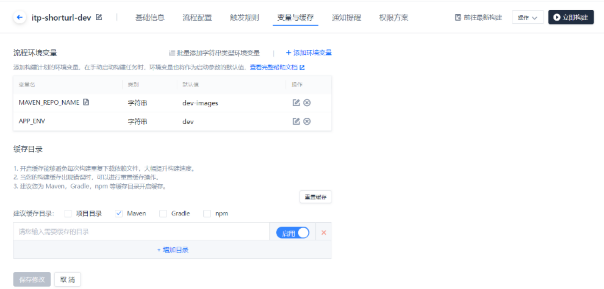
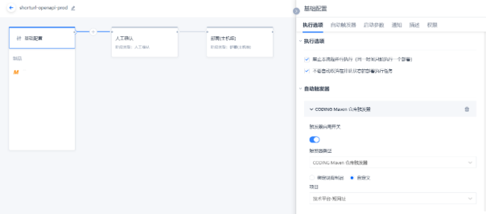
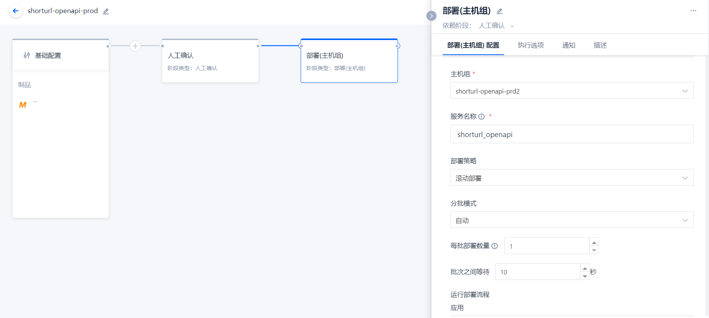
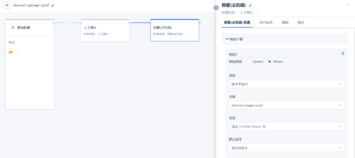
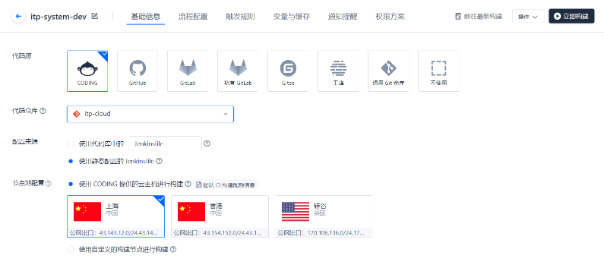
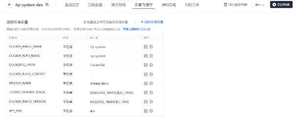
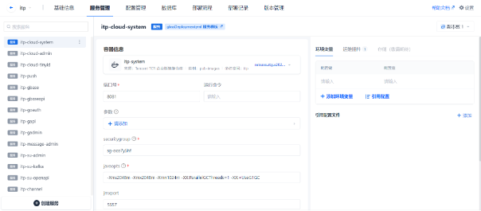
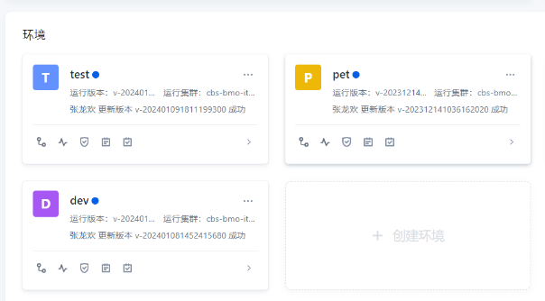
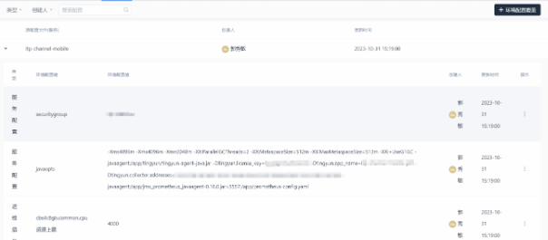
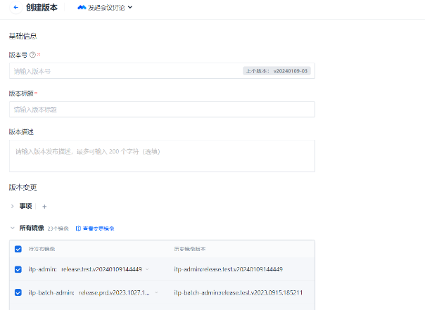

## （1）POM文件标准说明

在POM文件中，使用profile元素来定义特定的环境变量配置。profile元素允许您根据不同的环境（例如开发、测试、准生产、生产）为项目定义不同的配置。以下是对POM文件中profile环境变量的标准说明：

1. profile元素：在POM文件中，使用profile元素来定义一个或多个环境配置。每个profile元素包含一个唯一的id，用于标识该配置。

2. activation元素：在profile元素中，可以使用activation元素来指定激活该配置的条件。例如，您可以基于操作系统、Java版本、Maven版本等条件来激活特定的配置。

3. properties元素：在profile元素中，可以使用properties元素来定义环境变量。这些变量可以在项目中的其他地方引用。如下bootstrap.yml中就定义不同环境下的nacos链接信息。

```yaml
server:
  port: 8081

spring:
  profiles:
    active: @profile.active@
  application:
    name: macula-cloud-system
  cloud:
    nacos:
      username: ${nacos.username}
      password: ${nacos.password}
      config:
        server-addr: ${nacos.config.server-addr}
        namespace: ${nacos.config.namespace}
        # group:
        refresh-enabled: true
        file-extension: yml

# 和环境有关的配置信息，不同环境覆盖此处的配置
nacos:
  username: nacos
  password: nacos
  config:
    server-addr: 127.0.0.1:8848
    namespace: MACULA5

---
spring:
  config:
    activate:
      on-profile: dev
nacos:
  username: maculav5
  password: *****
  config:
    server-addr: 127.0.0.1:8848
    namespace: itp-dev


---
spring:
  config:
    activate:
      on-profile: test
nacos:
  username: maculav5
  password: ******
  config:
    server-addr: 127.0.0.1:8848
    namespace: itp-test


---
spring:
  config:
    activate:
      on-profile: staging
nacos:
  username: maculav5
  password: ******
  config:
    server-addr: 127.0.0.1:8848
    namespace: itp-staging

---
spring:
  config:
    activate:
      on-profile: prd
nacos:
  username: itp
  password: ******
  config:
    server-addr: 127.0.0.1:8848
    namespace: ITP
```

## （2）虚拟机打包部署

以腾讯云coding工具做虚拟机打包部署主要包括两部分内容，一是配置构建计划（CI），二是配置服务部署（CD）。以下按照itp-shorturl的CI/CD流程作说明。

* 配置构建计划的基础信息，如：代码仓库、配置来源、节点池配置，具体下图所示：


* 配置构建计划的流程配置，这里包含了代码检出、编译打包、修改版本号、把包推送到指定的仓库，具体如下：

```javascript
pipeline {
  agent any
  stages {
    stage('检出') {
      steps {
        checkout([$class: 'GitSCM',
        branches: [[name: GIT_BUILD_REF]],
        userRemoteConfigs: [[
          url: GIT_REPO_URL,
          credentialsId: CREDENTIALS_ID
        ]]])
      }
    }
    stage('编译') {
      steps {
        sh '''cd ./shorturl-parent
mvn clean package -P${APP_ENV} -DskipTests'''
      }
    }
    stage('修改版本号') {
      steps {
        sh '''CI_TIME=`date +%Y%m%d%H%M%S`
cd ./shorturl-parent;mvn versions:set -DnewVersion="dev"-$CI_TIME'''
      }
    }
    stage('推送到 CODING Maven 制品库') {
      steps {
        echo '发布中...'
        withCredentials([
          usernamePassword(
            credentialsId: "${CODING_ARTIFACTS_CREDENTIALS_ID}",
            usernameVariable: 'CODING_MAVEN_REG_USERNAME',
            passwordVariable: 'CODING_MAVEN_REG_PASSWORD'
          )
        ]) {
          sh 'cd ./shorturl-parent;mvn deploy -P${APP_ENV} -s ./settings.xml -DskipTests'
        }

        echo '发布完成.'
      }
    }
  }
  environment {
    CODING_MAVEN_REPO_ID = "${CCI_CURRENT_TEAM}-${PROJECT_NAME}-${MAVEN_REPO_NAME}"
    CODING_MAVEN_REPO_URL = "${CCI_CURRENT_WEB_PROTOCOL}://${CCI_CURRENT_TEAM}-maven.pkg.${CCI_CURRENT_DOMAIN}/repository/${PROJECT_NAME}/${MAVEN_REPO_NAME}/"
  }
}
```

* 配置构建计划的触发规则、变量与缓存（流程配置中用到的变量在这里定义），如下：



到这步构建计划已经配置完成了，可以点击“立即构建”并观察是否可以构建成功。如成功则可以进行下一步操作。

* 创建流程，这里可以配置自动触发器、人工确认节点、主机部署，如下图：



* 最后配置主机部署环节，这里可以配置主机组、部署策略、前置脚本（部署前需要执行的脚本，如：关闭服务，备份等）、制品下载（指定包在仓库的位置）、后置脚本（部署时需要执行的脚本，如：启动命名），如下图：



前置脚本，内容如下：

```bash
PID=`ps -ef | grep java | grep shorturl-openapi-0.0.1-SNAPSHOT.jar | awk '{print $2}'`
if [  "$PID" = "" ]; then
  echo "not running"
else
  echo "the service is RUNNING and it will be killed by agent"
  kill -9 $PID
fi
date_time=$(date "+%Y%m%d%H%M%S")
mv /work/shorturl_openapi/shorturl-openapi-0.0.1-SNAPSHOT.jar /work/shorturl_openapi/shorturl-openapi-0.0.1-SNAPSHOT.jar_$date_time
```

制品下载



后置脚本，内容如下：

```bash
java -Xms2048m -Xmx2048m -Xmn800m -XX:PermSize=256m -XX:MaxPermSize=256m -javaagent:/work/shorturl_openapi/tingyun/tingyun-agent-java.jar -jar /work/shorturl_openapi/shorturl-openapi-0.0.1-SNAPSHOT.jar --server.port=9095 > /dev/null 2>&1 &
```

经过以上的配置就可以启动流程做发布操作。

## （3）容器打包部署

以腾讯云coding工具做容器打包部署主要包括三部分中工作，一编写DockerFile文件，二配置构建计划（CI），三配置服务部署（CD）。以下按照配置itp-cloud-system的CI/CD流程作说明。

* 编写DockerFile文件，Dockerfile是一个用来构建镜像的文本文件，文本内容包含了一条条构建镜像所需的指令和说明。内容可参考如下：

```text
FROM infinitus-devops-docker.pkg.coding.net/ecp/base_images/centos-pub:latest
ENV LANG en_US.UTF-8
ENV LANGUAGE en_US:en
ENV LC_ALL en_US.UTF-8
ENV workdir /app
WORKDIR ${workdir}

COPY target/macula-cloud-system-*.jar /app/macula-cloud-system.jar
# 暴露8081端口
EXPOSE 8081
# 运行时的命令
ENTRYPOINT [ "sh", "-c", "java -jar ${JAVA_OPTS} macula-cloud-system.jar" ]
```

其中`infinitus-devops-docker.pkg.coding.net/ecp/base_images/centos-pub:latest`是IT基础架构和治理做好的基础镜像，该镜像已经包含了运行jar包所需的基础环境。

* 配置构建计划的基础信息，如：代码仓库、配置来源、节点池配置，具体下图所示：



* 配置构建计划的流程配置，这里包含了代码检出、编译打包、构建镜像、把镜像推送到指定的仓库，具体如下：

```javascript
pipeline {
  agent any
  stages {
    stage('检出') {
      steps {
        checkout([$class: 'GitSCM',
        branches: [[name: GIT_BUILD_REF]],
        userRemoteConfigs: [[
          url: GIT_REPO_URL,
          credentialsId: CREDENTIALS_ID
        ]]])
      }
    }
    stage('编译') {
      steps {
        sh 'mvn clean package -P${APP_ENV} -DskipTests=true -pl macula-cloud-api,macula-cloud-api/macula-cloud-system-api,macula-cloud-api/macula-cloud-triparty-api,macula-cloud-system'
      }
    }
    stage('构建镜像并推送到TCR') {
      steps {
        script {
          env.CI_TIME=sh(returnStdout: true, script: 'date +%Y%m%d%H%M%S').trim()
        }
        
        sh "export DOCKER_IMAGE_VERSION=$RELEASE_NAME$CI_TIME;cd ./macula-cloud-system && docker build -t ${DOCKER_IMAGE_NAME}:${DOCKER_IMAGE_VERSION} -f ${DOCKERFILE_PATH} ${DOCKER_BUILD_CONTEXT}"
        
        useCustomStepPlugin(key: 'SYSTEM:plugin_tcr_push', version: 'latest', params: [uin:'tcr$itp',tcr_instance_domain:'pub-images.tencentcloudcr.com',tcr_token:'2zRd7EnH6wxihQIthL2Pfj3wW5PhH9yv',tcr_namespace:'itp',tcr_repository:'${DOCKER_IMAGE_NAME}',tcr_image_tag:'${DOCKER_IMAGE_VERSION}',docker_image_path:'${DOCKER_IMAGE_NAME}:${DOCKER_IMAGE_VERSION}'])
      }
    }
  }
  environment {
    CODING_DOCKER_REG_HOST = "${CCI_CURRENT_TEAM}-docker.pkg.${CCI_CURRENT_DOMAIN}"
    CODING_DOCKER_IMAGE_NAME = "${PROJECT_NAME.toLowerCase()}/${DOCKER_REPO_NAME}/${DOCKER_IMAGE_NAME}"
  }
}
```

* 配置构建计划的触发规则、变量与缓存（流程配置中用到的变量在这里定义），如下：



到这步构建计划已经配置完成了，可以点击“立即构建”并观察是否可以构建成功。如成功则可以进行下一步操作。

* 服务管理中创建服务，需要指定镜像仓库、服务启动占用的端口号、安全组和资源限制，如下图：



* 创建环境，主要在这里维护当前环境各个服务的配置信息，如：实例数、安全组、听云、资源配置等。具体看下图：





* 创建版本，如下输入版本号、版本标题、选择对应的镜像后点发布即可。


